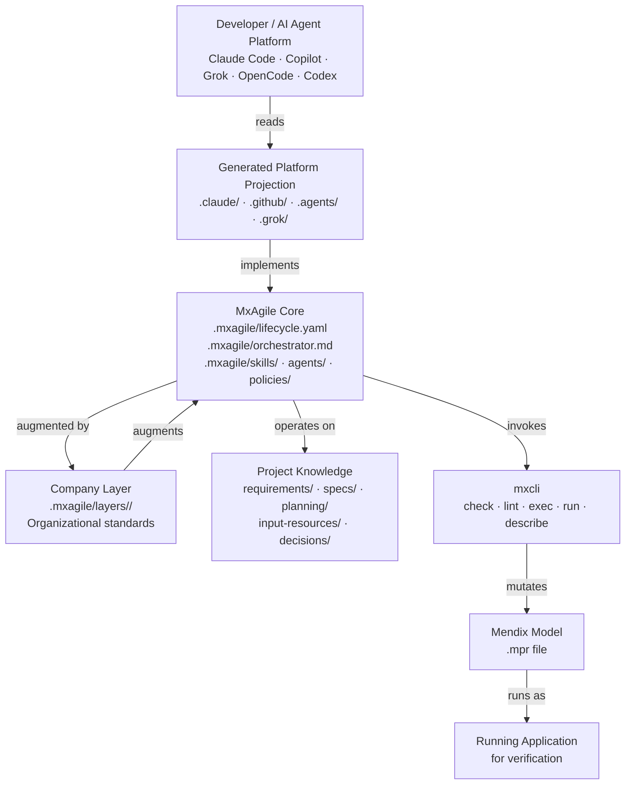
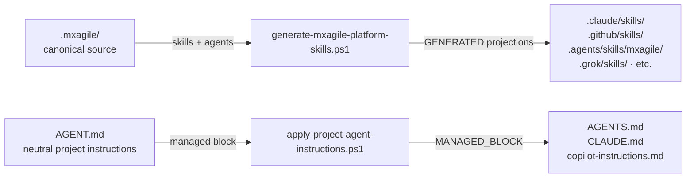
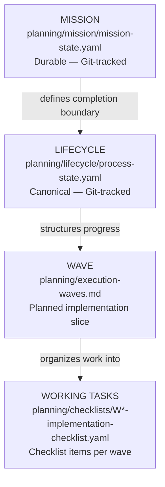
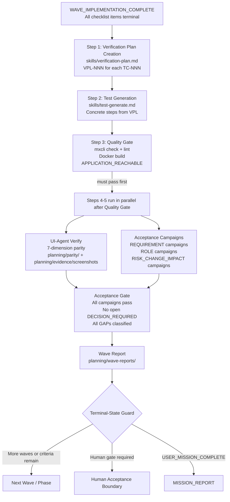

# MxAgile Architecture

This document describes the technical architecture of MxAgile. For detailed Mermaid diagrams and the ownership table, see [docs/architecture.md](docs/architecture.md).

## Layer Architecture

MxAgile is organized in layers that cleanly separate framework logic from organizational standards and project-specific knowledge.

**Ownership rules:**
- `.mxagile/` is **framework-owned**; consumer projects must not modify it directly
- Generated projections (`.claude/`, `.github/`, etc.) are **framework-owned** artifacts; edit canonical sources and regenerate
- `requirements/`, `specs/`, `planning/`, `input-resources/` are **project-owned**; preserved on Core update
- Company Layers are **externally-owned**; managed and versioned independently

## Source-Projection Architecture

Platform-specific files are generated from canonical sources. Never edit generated projections directly.

The canonical generation scripts are `scripts/generate-mxagile-platform-skills.ps1` and `scripts/apply-project-agent-instructions.ps1`. Both are invoked by `setup-agent-system.ps1`, which is called by `scripts/install-core.ps1` during every install and update.

## State Hierarchy

Work is organized in a strict hierarchy. Completing a lower level never implies a higher level is complete.

**Session cache:** `.concord/scratch/process-state.yaml` (gitignored) is a local session cache only. The authoritative Git-tracked state is `planning/lifecycle/process-state.yaml`.

**Mission state** (`planning/mission/mission-state.yaml`) persists user intent and completion criteria across sessions, context compression, and phase transitions. It is the primary source for fresh-session resume.

## Verification Flow

Verification is a structured campaign process, not ad-hoc checking.

**Verification invariants** (from `policies/mission-completion.md`):
- Successful `mxcli run --local` during Implementing ≠ verification started
- Runtime inspection during Implementing ≠ UI-Agent Verify
- Build success ≠ acceptance passed
- Wave report alone ≠ USER_MISSION_COMPLETE

## Operating-Mode Detection

The agent detects Mendix Studio Pro status **before any model mutation**. The detection is deterministic — the agent runs `scripts/check-studio-pro-status.ps1` and classifies the result. Asking the user is forbidden before this check runs.

| Mode | Studio Pro state | Agent behavior |
|---|---|---|
| `CLOSED-AUTONOM` | Closed | Full autonomous model mutations allowed |
| `LIVE-SP-CURRENT` | Open with this project | No model mutations; safe work (planning, docs) continues |
| `LIVE-SP-OTHER` | Open with a different project | Proceed autonomously |
| `AMBIGUOUS-SP-STATE` | Undetermined | Continue safe work; question only if mutation needed |

## Mission Completion Levels

These levels are **ordered**. A lower level never implies the next.

| Level | Definition |
|---|---|
| `IMPLEMENTATION_CHANGE_COMPLETE` | One checklist item done: mxcli check passes, lint passes, exec applied |
| `WAVE_IMPLEMENTATION_COMPLETE` | All checklist items terminal (`done \| blocked \| deferred`) — triggers automatic Verifying entry |
| `VERIFICATION_COMPLETE` | All VPLs created, quality-gate passed, UI-Agent Verify done, acceptance campaigns complete |
| `ACCEPTANCE_COMPLETE` | All campaigns PASS, no open DECISION_REQUIRED, all GAPs classified, wave report written |
| `USER_MISSION_COMPLETE` | All mission criteria (lifecycle-derived + user-additional) verified — permits terminal report |

## Artifact Schema Map

Canonical artifact locations and their schemas:

| Artifact | Location | Schema |
|---|---|---|
| Requirements | `requirements/REQ-NNN.yml` | `.mxagile/schemas/requirement.schema.json` |
| Specs | `specs/SPEC-NNN.yml` | `.mxagile/schemas/spec.schema.json` |
| Tasks | `planning/tasks/TASK-NNN.yml` | `.mxagile/schemas/task.schema.json` |
| Decisions | `planning/decisions/DEC-NNN.md` | `.mxagile/schemas/decision.schema.json` |
| Test Contracts | `planning/test-contracts/TC-NNN.yaml` | `.mxagile/schemas/test-contract.schema.json` |
| Verification Plans | `planning/verification-plans/VPL-NNN.yaml` | `.mxagile/schemas/verification-plan.schema.json` |
| Process State (canonical) | `planning/lifecycle/process-state.yaml` | `.mxagile/schemas/process-state.schema.json` |
| Mission State | `planning/mission/mission-state.yaml` | `.mxagile/schemas/mission-state.schema.json` |
| Evidence Manifest | `planning/evidence/manifests/<wave>-evidence-manifest.yaml` | `.mxagile/schemas/evidence-manifest.schema.json` |

## Reference Documentation

- [docs/architecture.md](docs/architecture.md) — detailed architecture diagrams and ownership tables
- [docs/installation.md](docs/installation.md) — installation and Core update guide
- [docs/injection-contract.md](docs/injection-contract.md) — authoritative artifact ownership contract
- [docs/schemas.md](docs/schemas.md) — canonical artifact schema contract
- [.mxagile/lifecycle.yaml](.mxagile/lifecycle.yaml) — machine-readable lifecycle state machine
- [.mxagile/orchestrator.md](.mxagile/orchestrator.md) — narrative lifecycle orchestration
- [.mxagile/policies/mission-completion.md](.mxagile/policies/mission-completion.md) — completion levels and Terminal-State Guard
- [.mxagile/policies/operating-mode.md](.mxagile/policies/operating-mode.md) — operating-mode detection contract
- [.mxagile/policies/commit-authority.md](.mxagile/policies/commit-authority.md) — checkpoint commit authority
