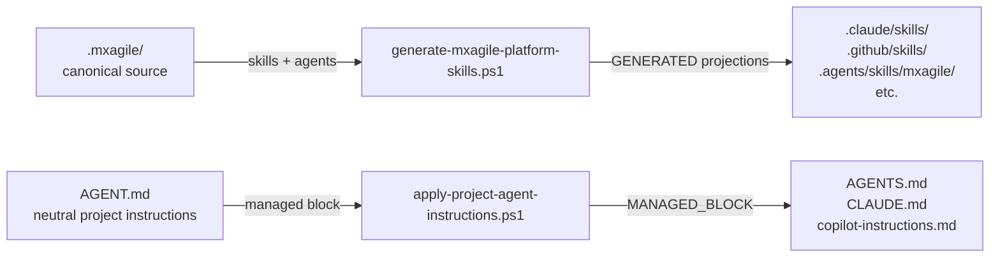

# MxAgile Repository Development Instructions

## Purpose

This repository develops the MxAgile framework itself.

Do not confuse framework development with a Mendix project that has MxAgile installed.

## Architecture

The public Bootstrap entry points are:

- install-mxagile.ps1
- install-mxagile-mercedes.ps1

Both delegate actual installation to:

- scripts/install-core.ps1

Do not duplicate installation behavior in the public bootstrap scripts.

## Source of Truth

.mxagile/ is the agent-agnostic source for MxAgile framework skills and agents.

Platform projections are generated artifacts.

Do not manually edit generated MxAgile projections.

After changing canonical agent/skill sources, use the canonical projection generator.

## Agent Instruction Architecture

AGENT.md is the neutral project-instruction source used by MxAgile installations.

Platform-specific files such as AGENTS.md, CLAUDE.md and Copilot instructions are
projections/adapters.

Changes to injected Agent behavior should normally originate from the canonical source,
not individual platform projections.

## Company Layers

Company Layers are external extensions of MxAgile Core.

The canonical installer supports:

- Git source
- explicit Local source

Do not introduce an implicit local Company Layer fallback.

## Architecture Overview

Generated platform projections must not be manually maintained.
Canonical source changes flow through the generator.

## Reference Documentation

- [docs/injection-contract.md](MxAi-Dev-System/docs/injection-contract.md) — authoritative artifact ownership contract
- [docs/architecture.md](MxAi-Dev-System/docs/architecture.md) — detailed architecture diagrams

## mxcli

`mxcli.exe` is the required Mendix engineering tool.

- Installer: `scripts/install-mxcli.ps1`
- Updater: `scripts/install-mxcli.ps1` (distributed to projects as `update-mxcli.ps1`)
- Ownership: MxAgile Core

Do not change mxcli installation without updating the canonical installer.

## Testing Strategy

- Tier 0: parser/static/marker validation — run first, run often
- Tier 1: managed block fixtures, injection snapshot, platform projection tests
- Tier 2: canonical install into disposable fixture project
- Tier 3+: E2E bootstrap (expensive — run on significant changes only)

See `tests/` directory for existing test suite.
