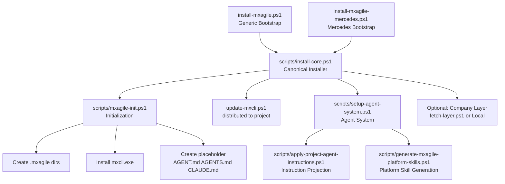
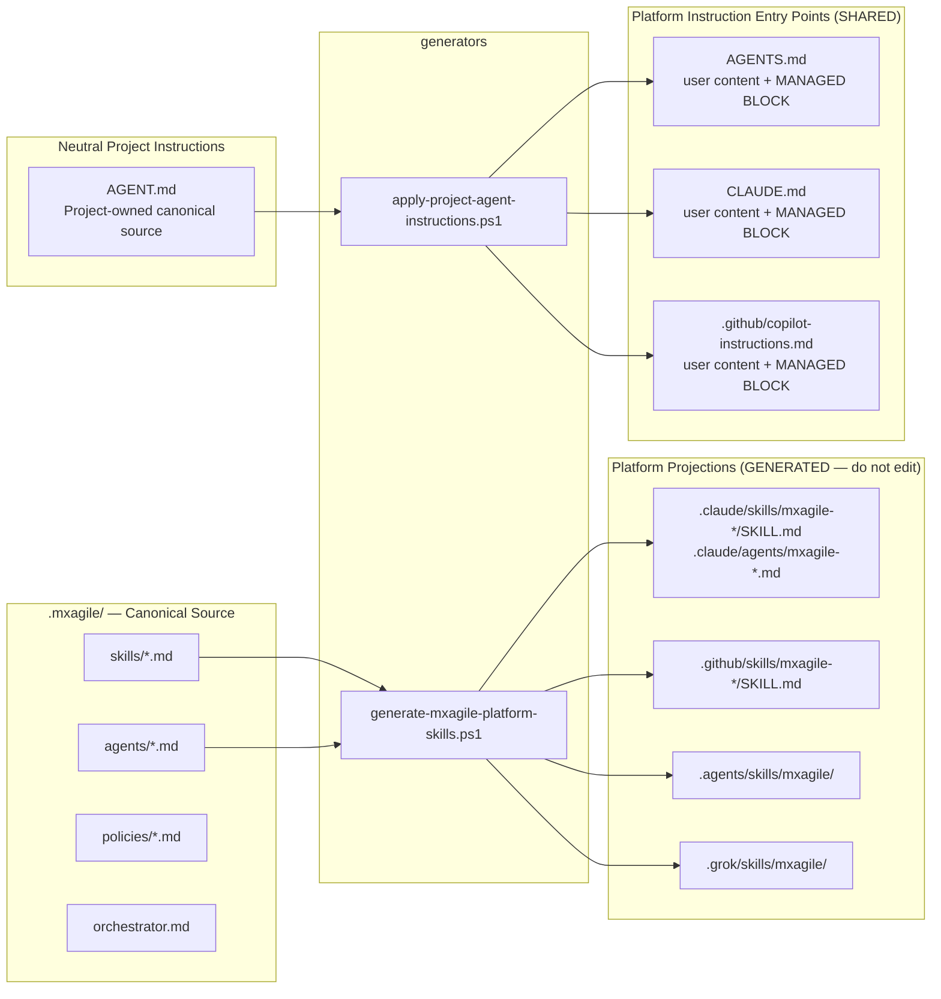
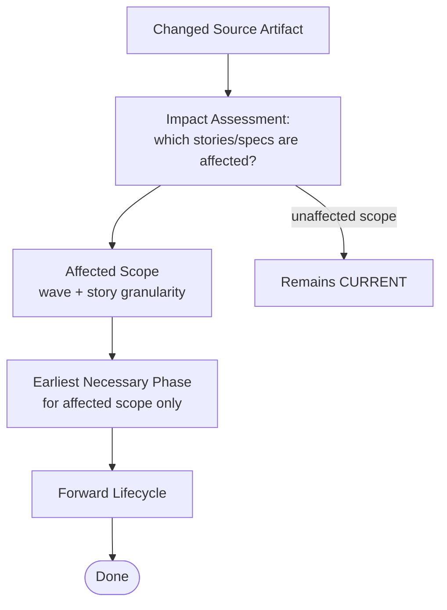

# MxAgile Architecture

---

## Section 1: Installation Architecture (Current)

---

## Section 2: Ownership Architecture

---

## Section 3: Canonical Lifecycle

Canonical machine-readable definition: `.mxagile/lifecycle.yaml` (schema_version: 1).
Narrative expansion: `.mxagile/orchestrator.md`.
Unit of progression: **wave** (a set of requirements processed together).

### Phase Flow

### Return Routing

| Condition | Return to | Scope |
|---|---|---|
| Implementation defect found in Verifying | Implementing | Failed checklist items only |
| Specification or refinement defect found | Refinement | Affected story specifications |
| Fundamental missing context or changed input | Discovery | Affected stories; unaffected remain CURRENT |

### Change Propagation

| Source change | May affect | Earliest return |
|---|---|---|
| Mockup changed | Story specs, UI inventory, implementation, verification | Discovery |
| Spec changed after implementation | Checklist, implementation, verification | Refinement |
| Implementation defect | Verification evidence | Implementing |

MxAgile skills implement individual phases. The installer provides the foundation; lifecycle execution requires an active agent session.

---

## Section 4: Implemented Architectural Features

### 4a: Infrastructure and Tooling (Completed)

| Area | Resolution |
|------|---------|
| Managed block markers | `apply-project-agent-instructions.ps1` detects and auto-migrates old `<!-- BEGIN PROJECT AGENT INSTRUCTIONS -->` → `<!-- MXAGILE:MANAGED:START/END -->` |
| Skill directory naming | `generate-mxagile-platform-skills.ps1` uses `mxagile/` prefix (was `dfc/`) |
| Managed block position | Block appended at END of user content on first insert; replaced in-place on re-runs |
| Malformed/duplicate block detection | `Apply-ManagedBlock` fails with diagnostic on DUPLICATE or MALFORMED |
| Company Layer `.git/` stripping | `fetch-layer.ps1` and `install-core.ps1` strip nested `.git/` on install |
| System Check skill | `.mxagile/skills/system-check.md` (read-only diagnostic) |
| Injection Contract | `docs/injection-contract.md` (authoritative artifact ownership contract) |
| Post-install validation | Shown after successful `install-core.ps1` |
| Canonical lifecycle source | `lifecycle.yaml` (machine-readable) + narrative `orchestrator.md` |

### 4b: Canonical Artifact Contract (WP-10)

| Area | Resolution |
|------|---------|
| Canonical schemas | `requirement.schema.json`, `spec.schema.json`, `task.schema.json` in `.mxagile/schemas/` |
| Canonical field names | `ID:` (not `req_id:`/`spec_id:`/`task_id:`); `action:` for tasks; `.yml` extension |
| Canonical templates | `requirements/template.yml`, `specs/template.yml`, `planning/tasks/template.yaml` |
| Artifact index | `scripts/build_artifact_index.py` reads canonical fields; emits WARN for broken references |
| Semantic conversion engine | `scripts/canonicalize_artifacts.py` + `scripts/migrate-stories.ps1` |
| Authoritative contract | `docs/schemas.md` (producer/consumer alignment table) |

### 4c: Brownfield Artifact Canonicalization Lifecycle

| Area | Resolution |
|------|---------|
| Lifecycle distinction | Framework migration (`status: complete` in `state.yaml`) ≠ artifact canonicalization |
| Canonicalization state | `artifact_canonicalization: pending/in_progress/complete` in `state.yaml` |
| Hybrid mode | Valid project state: migration complete + canonicalization pending |
| Canonicalization skill | `.mxagile/skills/migration.md` |
| Policy | Covered in `.mxagile/policies/migration-dfc-to-mxagile.md` Section "Brownfield Artifact Canonicalization" |
| Resumability | `canonicalization-state.yaml` tracks per-artifact progress; re-running is safe |

### 4d: Existing-Project Core Update Contract

| Area | Resolution |
|------|---------|
| Update entry point | `install-core.ps1` — same script for fresh install AND existing-project Core sync |
| Stale artifact retirement | Step 1c.1: clears framework-owned `.mxagile/` content before canonical copy |
| Fresh-install equivalence | Updated install surface = fresh install of same Core version |
| Protected directories | `layers/`, `state/`, `migration/` — never touched by update |
| `artifact_canonicalization` reconciliation | Step 1d: adds `artifact_canonicalization: pending` to pre-WP-10 `state.yaml` if field absent |
| Regression coverage | `tests/test-existing-project-update.ps1` (75 assertions) |

---

## Section 5: File Ownership Summary

| File / Directory | Owned By | Edit How |
|-----------------|----------|----------|
| `.mxagile/skills/*.md` | MxAgile Framework Developer | Edit canonical source; regenerate projections |
| `.mxagile/agents/*.md` | MxAgile Framework Developer | Edit canonical source; regenerate projections |
| `.mxagile/policies/*.md` | MxAgile Framework Developer | Edit canonical source |
| `.mxagile/schemas/*.json` | MxAgile Framework Developer | Edit canonical source |
| `.mxagile/templates/` | MxAgile Framework Developer | Edit canonical source |
| `.claude/skills/mxagile-*/` | MxAgile (generated) | Do NOT edit — rerun generator |
| `.github/skills/mxagile-*/` | MxAgile (generated) | Do NOT edit — rerun generator |
| `.claude/agents/mxagile-*.md` | MxAgile (generated) | Do NOT edit — rerun generator |
| `.agents/skills/mxagile/` | MxAgile (generated) | Do NOT edit — rerun generator |
| `AGENT.md` | Project / User | Edit freely |
| `AGENTS.md` | Shared (user + MxAgile block) | Edit user sections freely; managed block auto-replaced |
| `CLAUDE.md` | Shared (user + MxAgile block) | Edit user sections freely; managed block auto-replaced |
| `.github/copilot-instructions.md` | Shared (user + MxAgile block) | Edit user sections freely; managed block auto-replaced |
| `requirements/`, `specs/`, `planning/` | Project / User | Edit freely; never overwritten by Core update |
| `.mxagile/layers/` | Company Layer / User | Managed by layer installer; never touched by Core update |
| `.mxagile/state/` | Project Runtime | Never overwritten; preserved on Core update |
| `.mxagile/migration/` | Project Migration History | Never overwritten; preserved on Core update |
| `*.mpr` | Mendix Studio Pro | Never touched by MxAgile |
