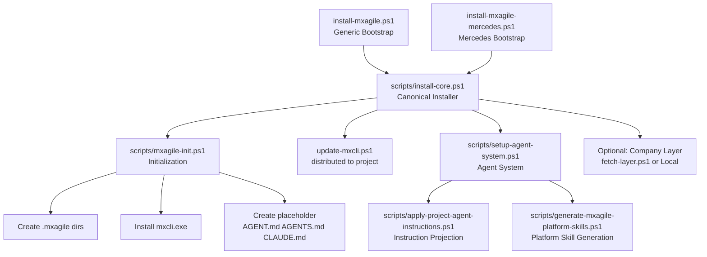
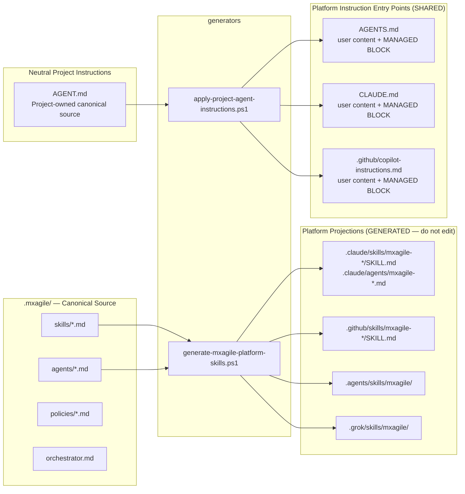
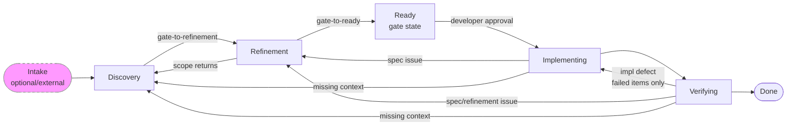

# MxAgile Architecture

---

## Section 1: Installation Architecture (Current)

---

## Section 2: Ownership Architecture

---

## Section 3: Canonical Lifecycle

Canonical machine-readable definition: `.mxagile/lifecycle.yaml` (schema_version: 1).
Narrative expansion: `.mxagile/orchestrator.md`.
Unit of progression: **wave** (a set of requirements processed together).

### Phase Flow

### Return Routing

| Condition | Return to | Scope |
|---|---|---|
| Implementation defect found in Verifying | Implementing | Failed checklist items only |
| Specification or refinement defect found | Refinement | Affected story specifications |
| Fundamental missing context or changed input | Discovery | Affected stories; unaffected remain CURRENT |

### Change Propagation

| Source change | May affect | Earliest return |
|---|---|---|
| Mockup changed | Story specs, UI inventory, implementation, verification | Discovery |
| Spec changed after implementation | Checklist, implementation, verification | Refinement |
| Implementation defect | Verification evidence | Implementing |

MxAgile skills implement individual phases. The installer provides the foundation; lifecycle execution requires an active agent session.

---

## Section 4: Current vs Target Gaps

| Area | Current | Target | Status |
|------|---------|--------|--------|
| Managed block markers | `<!-- BEGIN PROJECT AGENT INSTRUCTIONS -->` | `<!-- MXAGILE:MANAGED:START -->` | MIGRATION IMPLEMENTED — `apply-project-agent-instructions.ps1` detects and migrates old markers |
| Skill directory naming (Codex/Grok/etc.) | `dfc/` | `mxagile/` | FIXED — `generate-mxagile-platform-skills.ps1` now uses `mxagile/` |
| Managed block position | Block inserted at TOP (before user content) | Block inserted at END (user content first) | FIXED — new `Apply-ManagedBlock` function appends at end on first insert |
| Malformed/duplicate block detection | Silent overwrite | Fail with diagnostic | FIXED — `Apply-ManagedBlock` fails with clear error on DUPLICATE or MALFORMED |
| Mercedes layer `.git/` in dev repo | Present (staged for deletion) | Absent (stripped on install) | `fetch-layer.ps1` and `install-core.ps1` strip `.git/` on install; dev repo had it temporarily |
| System Check skill | Absent | `.mxagile/skills/system-check.md` | CREATED |
| Injection Contract document | Absent | `docs/injection-contract.md` | CREATED |
| Post-install validation prompt | Absent | Shown after successful install | ADDED to `install-core.ps1` |
| Agent behavioral validation | Not systematic | System Check skill (section H) | CREATED |
| Script canonical name (generator) | `generate-dfc-platform-skills.ps1` | `generate-mxagile-platform-skills.ps1` | RENAMED |
| Canonical lifecycle source | Narrative only in `orchestrator.md`; wrong phase names in architecture.md (Requirements, Planning, Convergence) | `lifecycle.yaml` (machine-readable) + corrected diagrams | CREATED |
| Architecture lifecycle diagram | CURRENT/TARGET split with non-canonical phase names | Canonical phases + feedback-loop diagram + change-propagation diagram | FIXED |
| System Check lifecycle validation | Hardcoded phase string referencing `orchestrator.md` | Reads `lifecycle.yaml` to validate canonical source exists | FIXED |

---

## Section 5: File Ownership Summary

| File / Directory | Owned By | Edit How |
|-----------------|----------|----------|
| `.mxagile/skills/*.md` | MxAgile Framework Developer | Edit canonical source; regenerate projections |
| `.mxagile/agents/*.md` | MxAgile Framework Developer | Edit canonical source; regenerate projections |
| `.claude/skills/mxagile-*/` | MxAgile (generated) | Do NOT edit — rerun generator |
| `.github/skills/mxagile-*/` | MxAgile (generated) | Do NOT edit — rerun generator |
| `.claude/agents/mxagile-*.md` | MxAgile (generated) | Do NOT edit — rerun generator |
| `.agents/skills/mxagile/` | MxAgile (generated) | Do NOT edit — rerun generator |
| `AGENT.md` | Project / User | Edit freely |
| `AGENTS.md` | Shared (user + MxAgile block) | Edit user sections freely; managed block auto-replaced |
| `CLAUDE.md` | Shared (user + MxAgile block) | Edit user sections freely; managed block auto-replaced |
| `.github/copilot-instructions.md` | Shared (user + MxAgile block) | Edit user sections freely; managed block auto-replaced |
| `requirements/`, `specs/`, `planning/` | Project / User | Edit freely; never overwritten |
| `*.mpr` | Mendix Studio Pro | Never touched by MxAgile |
