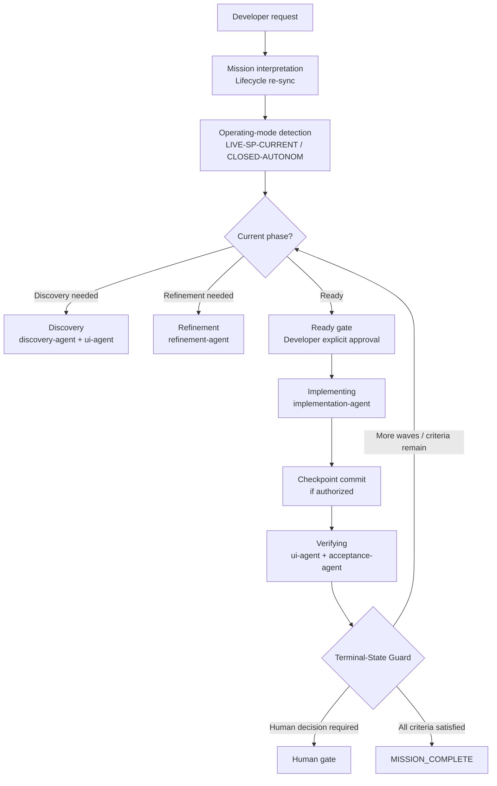
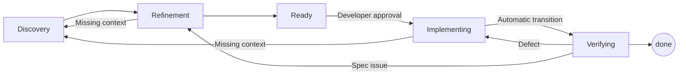

# MxAgile

MxAgile is a lifecycle-driven, agent-oriented Mendix development framework. Developers express desired outcomes in simple language — "Implement REQ-084", "Continue with the project" — and the framework handles repository orientation, lifecycle progression, implementation, verification, and acceptance.

MxAgile is **platform-agnostic**: the same canonical source (`.mxagile/`) runs on Claude Code, GitHub Copilot, Grok, OpenCode, Hermes, and Codex.

## Why MxAgile

Without MxAgile, every AI-assisted Mendix session requires the developer to manually manage lifecycle phases, re-sync state after pauses, track what "done" really means at each level, and prompt each verification step individually.

With MxAgile, the developer says:

```text
"Implement REQ-084."
```

The framework handles everything else: lifecycle re-sync, operating-mode detection, implementation checklist execution, checkpoint commits, verification campaigns, and the correct terminal boundary.

## How It Works



## Lifecycle

The unit of progression is the **wave** — a planned implementation slice. Each wave traverses these phases, defined in `.mxagile/lifecycle.yaml`:



| Phase | Purpose | Exit Gate |
|---|---|---|
| **Discovery** | Analyse all sources; classify evidence by level (static/model/runtime/browser) | gate-to-refinement |
| **Refinement** | Resolve all DECISION REQUIRED items; produce Test Contracts | gate-to-ready |
| **Ready** | Gate state — implementation checklist generated | Developer explicit approval |
| **Implementing** | Execute checklist item by item via mxcli MDL | All items in terminal state |
| **Verifying** | Quality-gate, UI fidelity, acceptance campaigns, acceptance gate | All four dimensions pass |

Return routing is **scoped**: only affected stories return to earlier phases; unaffected stories remain CURRENT.

## Core Concepts

| Concept | Meaning |
|---|---|
| **Mission** | The developer's stated goal, persisted in `planning/mission/mission-state.yaml` |
| **Lifecycle** | Ordered phases a wave traverses, defined in `.mxagile/lifecycle.yaml` |
| **Wave** | A planned implementation slice; the unit of lifecycle progression |
| **Working Tasks** | Implementation checklist items within the current wave |
| **Requirement (REQ)** | `requirements/REQ-NNN.yml` — what the system must do |
| **Spec (SPEC)** | `specs/SPEC-NNN.yml` — how a requirement is detailed |
| **Decision (DEC)** | `planning/decisions/DEC-NNN.md` — resolved design decision |
| **Test Contract (TC)** | WHAT must be proven for a requirement (produced in Refinement) |
| **Verification Plan (VPL)** | WHICH evidence layers to run (produced at Verifying entry) |
| **Evidence** | Classified proof: STATIC / MODEL / BUILD / RUNTIME / FRONTEND |
| **Source mockups** | Immutable input from the customer or design tool (`input-resources/ui-ux/`) |
| **Target mockup** | Refined acceptance target derived from source mockups |
| **Acceptance** | Structured campaigns proving all requirement proof points |
| **Core** | The `.mxagile/` framework payload — canonical agents, skills, policies, schemas |
| **Company Layer** | An organizational extension added on top of Core (e.g. Mercedes standards) |
| **Project Layer** | Project-specific artifacts: requirements, specs, tasks, decisions, mockups |

## Autonomy Model

MxAgile agents **may autonomously:**

- Inspect repository and lifecycle state
- Determine operating mode via `scripts/check-studio-pro-status.ps1` — never by asking
- Execute deterministic lifecycle work (discovery, refinement, implementation, verification)
- Create authorized local checkpoint git commits (see `policies/commit-authority.md`)
- Re-sync after phase transitions and continue into the next phase without user confirmation

MxAgile agents **must stop at:**

- Genuine product decisions (`DECISION_REQUIRED`)
- Human acceptance boundaries (acceptance evidence prepared; awaiting approval)
- Genuinely unsafe or destructive operations
- Conditions blocking ALL remaining valid next actions

**Local commit authority ≠ push authority.** MxAgile may create local commits when authorized. It never pushes to the remote repository autonomously.

### Operating-Mode Detection

Before any model mutation the agent runs `check-studio-pro-status.ps1` and classifies:

| Mode | Meaning |
|---|---|
| `CLOSED-AUTONOM` | Studio Pro is closed — full autonomous model changes allowed |
| `LIVE-SP-CURRENT` | Studio Pro has this project open — no model mutations; safe steps continue |
| `LIVE-SP-OTHER` | Studio Pro open with a different project — proceed autonomously |
| `AMBIGUOUS-SP-STATE` | Cannot determine state — question only if a mutation is needed |

The agent **never asks the user** about operating mode before running the detection script.

### Terminal-State Guard

Before declaring "done" or "finished," the agent runs the Terminal-State Guard (`policies/mission-completion.md`). Only `MISSION_COMPLETE` permits an unqualified terminal report.

**These are NOT mission complete:**

| What happened | What it actually means |
|---|---|
| Implementation checklist empty | `WAVE_IMPLEMENTATION_COMPLETE` — enter Verifying next |
| `mxcli check` passes | Technical gate — not verification or acceptance |
| Wave report written | Acceptance evidence recorded — more waves may remain |
| TODO list empty | Re-sync trigger — evaluate wave and mission next |

## Developer UX

MxAgile is designed so developers do not need lifecycle vocabulary.

| Developer says | MxAgile handles |
|---|---|
| `"Check this project."` | `skills/system-check.md` — read-only health report |
| `"Implement REQ-084."` | Lifecycle re-sync → discovery/refinement if needed → ready gate → implementation → checkpoint commit → verification campaigns → acceptance → terminal-state guard |
| `"Implement REV-014."` | Same, across all waves in the revision scope; wave transitions are automatic |
| `"Continue with the project."` | Reads `mission-state.yaml` + `process-state.yaml` → determines next deterministic action |
| `"Only implement the model changes."` | Explicit scope boundary honored; stops at `REVISION_IMPLEMENTATION_COMPLETE` |
| `"Verify the current implementation."` | Enters Verifying: quality-gate, UI fidelity, acceptance campaigns |
| `"Show me what is blocking the next step."` | Lifecycle re-sync → identifies gate failures or blockers → reports them |

## Quick Start

**Prerequisites:** PowerShell 5.1+ (PowerShell 7+ recommended); `mxcli.exe` in the project directory or on PATH.

**Fresh install (new Mendix project):**

```powershell
.\mxagile-setup.ps1 -ProjectRoot "path\to\your\project"
```

**Mercedes-Benz Company Layer:**

```powershell
.\mxagile-setup-mercedes.ps1 -ProjectRoot "path\to\your\project"
```

`mxagile-setup.ps1` auto-detects project state and performs either a fresh INSTALL or a Core UPDATE.

> `install-mxagile.ps1` and `install-mxagile-mercedes.ps1` are deprecated wrappers that delegate to the scripts above.

**Typical developer prompts after setup:**

```text
"Check this project."
"Implement REQ-084."
"Implement REV-014."
"Continue with the project."
"Verify the current implementation."
"Show me what is blocking the next step."
```

## Repository Structure

```
.mxagile/               # Framework-owned — canonical agents, skills, policies, schemas
  agents/               #   8 specialist agents
  skills/               #   12 reusable procedures
  policies/             #   44 behavioral contracts
  schemas/              #   19 artifact schemas
  lifecycle.yaml        #   Machine-readable lifecycle state machine
  orchestrator.md       #   Narrative lifecycle expansion
  GLOSSARY.yaml         #   Canonical terminology

.claude/agents/         # GENERATED — Claude Code agent projections
.claude/skills/         # GENERATED — Claude Code skill projections
.github/skills/         # GENERATED — GitHub Copilot skill projections
.agents/skills/         # GENERATED — Codex skill projections
.grok/skills/           # GENERATED — Grok skill projections
.opencode/skills/       # GENERATED — OpenCode skill projections

requirements/           # Project-owned — REQ-NNN.yml requirement artifacts
specs/                  # Project-owned — SPEC-NNN.yml specification artifacts
planning/               # Project-owned — waves, checklists, decisions, task artifacts
  decisions/            #   DEC-NNN resolved design decisions
  checklists/           #   W*-implementation-checklist.yaml per wave
  test-contracts/       #   TC-NNN.yaml — WHAT to prove (produced in Refinement)
  wave-reports/         #   Acceptance evidence per wave
  ui-inventory/         #   UI field inventory and parity comparison
  parity/               #   UI parity comparison results (planning/parity)
  evidence/             #   Promoted screenshots and evidence manifests
    screenshots/        #   Git-tracked promoted screenshots (planning/evidence/screenshots)
    manifests/          #   Wave evidence manifests
  mission/              #   mission-state.yaml — durable mission contract
  lifecycle/            #   process-state.yaml — canonical Git-tracked lifecycle state

input-resources/        # Project-owned — source mockups, requirements documents
  ui-ux/                #   Source mockups (immutable customer input)

.concord/               # Gitignored — ephemeral session cache; temporary screenshots
  scratch/              #   process-state.yaml session cache only
  screenshots/          #   Temporary screenshots (promote to planning/evidence/ to persist)

scripts/                # Installer, lifecycle, and utility scripts
tests/                  # Tier 0/1/2 test suite
docs/                   # Reference documentation

.env.mendix             # NEVER committed — contains database credentials and secrets
```

**Ownership summary:**

| Owner | Paths |
|---|---|
| Framework Core | `.mxagile/` |
| Generated projections | `.claude/`, `.github/`, `.agents/`, `.grok/`, etc. |
| Company Layer | `.mxagile/layers/<layer-name>/` |
| Project artifacts | `requirements/`, `specs/`, `planning/`, `input-resources/` |
| Gitignored / ephemeral | `.concord/`, `.env.mendix` |

## Skills and Agents

**Skills** are reusable procedural capabilities invoked by agents and developers.

| Skill | Purpose |
|---|---|
| `discovery` | Systematic analysis of all sources before refinement/implementation |
| `refinement` | Clarify open points, contradictions, and missing business rules |
| `gate-to-refinement` | Verify Discovery is complete before Refinement begins |
| `gate-to-ready` | Verify Refinement is complete; generate implementation checklist |
| `quality-gate` | Technical validation: mxcli check, lint, Docker build, runtime reachability |
| `test-contract` | Derive TC-NNN (WHAT to prove) from requirement acceptance criteria |
| `verification-plan` | Derive VPL-NNN (WHICH evidence layers) from a Test Contract |
| `test-generate` | Generate concrete test steps (HOW) from a Verification Plan |
| `visual-verification` | Playwright-based UI and parity verification |
| `brownfield-adoption` | Reverse-engineer an existing Mendix project into MxAgile spec files |
| `migration` | Convert legacy DFC-AI artifacts to canonical MxAgile format |
| `system-check` | Read-only installation health report |

**Agents** are role-oriented execution contracts.

| Agent | Phase(s) | Role |
|---|---|---|
| `discovery-agent` | Discovery | Systematic source analysis; produces story specs and UI inventory |
| `ui-agent` | Discovery + Verifying | Mockup analysis, generation, and visual parity verification |
| `refinement-agent` | Refinement | Resolves open decisions; derives Test Contracts |
| `implementation-agent` | Implementing | Executes checklist items via mxcli MDL |
| `acceptance-agent` | Verifying | Runs REQUIREMENT, ROLE, and RISK_CHANGE_IMPACT campaigns |
| `maintainer` | Maintenance | Inspects, diagnoses, and migrates MxAgile installations |
| `migration-agent` | Pre-lifecycle | Non-destructive DFC-AI → MxAgile migration |
| `mocketeer-agent` | Bridge | Design Contract intake from MxMocketeer |

## Verification and Acceptance

These completion levels are ordered and non-synonymous:

```
IMPLEMENTATION_CHANGE_COMPLETE  →  checklist item done
WAVE_IMPLEMENTATION_COMPLETE    →  all checklist items terminal (triggers Verifying automatically)
VERIFICATION_COMPLETE           →  all campaigns and evidence complete
ACCEPTANCE_COMPLETE             →  acceptance gate passed; wave report written
USER_MISSION_COMPLETE           →  all mission criteria satisfied (permits terminal report)
```

**Verification covers four dimensions per wave:**
1. **Quality gate:** `mxcli check`, `mxcli lint`, Docker build, APPLICATION_REACHABLE
2. **UI fidelity:** UI-Agent parity report across 7 dimensions
3. **Acceptance campaigns:** REQUIREMENT, ROLE, and RISK_CHANGE_IMPACT per Test Contract
4. **Acceptance gate:** all campaigns pass, no open DECISION_REQUIRED, all GAPs classified

Evidence is classified by layer (STATIC / MODEL / BUILD / RUNTIME / FRONTEND) and security dimension (VISIBILITY / ACCESSIBILITY / AUTHORIZATION / DATA_SCOPE).

## Updating MxAgile

`mxagile-setup.ps1` detects project state and performs the correct operation automatically.

**On update, the installer:**
- Preserves all project-owned artifacts (requirements, specs, planning, mockups)
- Preserves Company Layers (updated independently via `update-layer.ps1`)
- Retires stale framework-owned files and re-installs the current Core payload
- Re-runs `apply-project-agent-instructions.ps1` and `generate-mxagile-platform-skills.ps1`
- Writes `core-provenance.json` with version and commit identity

**After changing canonical `.mxagile/` sources** (skills, agents, policies), regenerate platform projections:

```powershell
.\scripts\generate-mxagile-platform-skills.ps1
.\scripts\apply-project-agent-instructions.ps1
```

### Reconciliation

When a Core update or phase return encounters in-progress lifecycle work:

- **Discovery Reconciliation:** Existing evidence is assessed for reuse. Static evidence (mockup-derived) may be marked REUSABLE; browser evidence may need re-collection. This process uses **conservative evidence reuse** — only evidence that conflicts with changed sources is invalidated.
- **Refinement Reconciliation:** Existing decisions and Test Contracts are assessed. Only decisions affected by source changes need revisiting.

Full contract: `.mxagile/policies/reconciliation.md`

## Documentation Map

| Document | Audience | Purpose |
|---|---|---|
| **README.md** | Everyone | Start here — product overview, quick start, developer UX |
| **ARCHITECTURE.md** | Developers | Technical architecture and component relationships |
| **docs/architecture.md** | Developers | Detailed architecture diagrams and ownership tables |
| **docs/installation.md** | Developers | Installation and Core update guide |
| **docs/schemas.md** | Framework developers | Artifact schema contract (REQ/SPEC/TASK) |
| **docs/injection-contract.md** | Framework developers | Artifact ownership contract |
| **.mxagile/orchestrator.md** | Agents | Canonical lifecycle orchestration behavior |
| **.mxagile/lifecycle.yaml** | Agents | Machine-readable lifecycle state machine |
| **.mxagile/policies/** | Agents | Behavioral contracts (44 policies) |
| **.mxagile/skills/** | Agents | Reusable execution procedures (12 skills) |
| **.mxagile/agents/** | Agents | Specialist role definitions (8 agents) |
